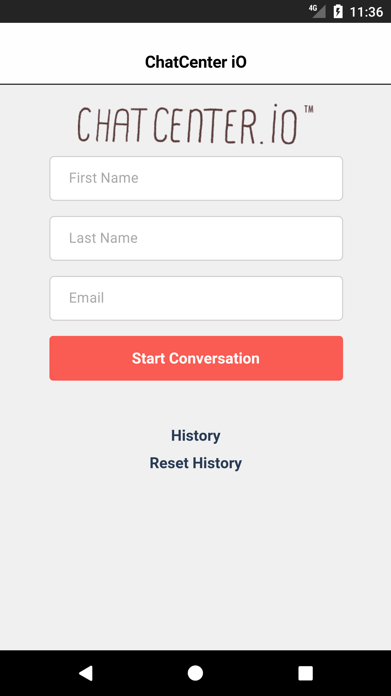
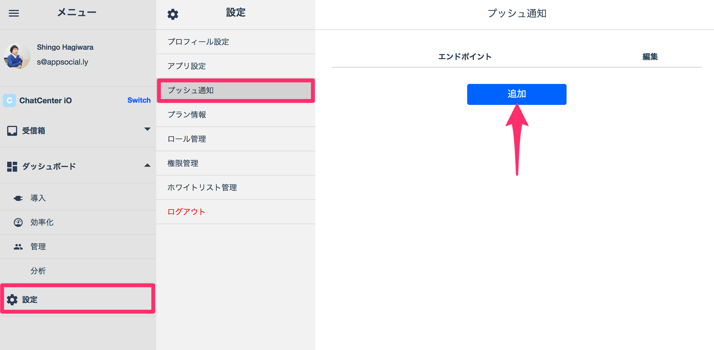

# ChatCenter iO Android SDK Installation guide Ver. 1.0.9

## Table of contents
* [Getting Started](#GettingStarted)
    * [1. サンプルプロジェクトをダウンロード](#DLSample)
    * [2. アプリケーションを起動](#LaunchApp)
* [Installing SDK on app](#InstallYourApp)
    * [1. Android Studioでの設定](#SettingOfAndroidStudio)
    * [2. チャットビューの呼び出し](#DispalyChatView)
    * [3. ヒストリービューの呼び出し](#DispalyHistoryView)
    * [4. ユーザーのログアウト](#LogoutUser)
    * [5. オプション](#Option)

<a id="GettingStarted"></a>
## Getting Started

<a id="DLSample"></a>
#### 1. サンプルプロジェクトをダウンロード
[こちら](https://github.com/chatcenter/android)よりChatCenterSDKをダウンロードします。
CordovaExampleプロジェクトが含まれています。


<a id="LaunchApp"></a>
#### 2. アプリケーションを起動
<p align="center"></p>

<a id="InstallYourApp"></a>
## SDKをアプリに組み込む

<a id="SettingOfAndroidStudio"></a>
### 1. Android Studioでの設定

<a id="1InstallSDK"></a>
#### 1-1. SDKのインストール
build.gradleに以下を追加してください。

    repositories {   
        ・・・   
        ↓ add   
        maven { url  "http://tokbox.bintray.com/maven" }   
    }   
   
    dependencies {   
        ・・・   
        ↓ add   
        compile 'ly.appsocial:chatcenter-android-sdk:1.0.+';   
    }   

***

<a id="2EditManifest"></a>
#### 1-2. AndroidManifestの編集
ChatCenter SDKでは各ウィジェットの送信時に、ユーザーの情報を使用する場合があります。そのためAndroidManifestに許諾の設定をお願いします。
許諾の必要があるものは以下です。

    <uses-permission android:name="android.permission.INTERNET" />
    <uses-permission android:name="android.permission.WAKE_LOCK" />
    <uses-permission android:name="android.permission.ACCESS_NETWORK_STATE" />


続いて、Sampleの時と同じようにAppTokenを`<application></application>`内に記述します。


    <meta-data
            android:name="ly.appsocial.chatcenter.AppToken"
            android:value="[YOUR_APP_TOKEN_HERE]"/>

ChatCenter SDKではロケーションウィジェットでGoogle Maps SDKを使用しています。
そのためGoogle APIのダッシュボードでGoogle API Keyを取得して、Samoleのように`<application></application>`内にセットしてください。

    <meta-data
           android:name="com.google.android.geo.API_KEY"
           android:value="[YOUR_GOOGLE_API_KEY]"/>

またGoogle APIのダッシュボードにて、Google Maps Android APIおよびGoogle Places API for Androidが有効になっていることをご確認ください。
<p align="center"></p>
		   
***

<a id="3AddCDVChatCenterPlugin"></a>
#### 1-3. CDVChatCenterプラグインの追加
新しいjavaパッケージをプロジェクトを追加してください。

    ly.appsocial.chatcenter.cordova

次に、[CordovaPlugin](https://github.com/appsocially/chatcenter-android/tree/feature/codova_plugin/CordovaPlugin)フォルダーを開いて、<b>CDVChatCenter.java</b>を新しいパッケージに追加してください。

***

<a id="4ConfigCDVChatCenterPlugin"></a>
#### 1-4. CDVChatCenterプラグインをConfigファイルに追加
<b>/res/xml</b>フォルダー内の<b>config.xml</b>ファイルを開いて、Sampleと同様に以下を追加します。

    <feature name="CDVChatCenter">
        <param name="android-package" value="ly.appsocial.chatcenter.cordova.CDVChatCenter"/>
        <param name="onload" value="true"/>
    </feature>
           
***

<a id="5Usage"></a>
#### 1-5. 使い方
Sampleの<b>index.js</b>のようにjsファイルを編集して<b>CBVChatCenter.java</b>内のメソッドをコールして使用してください。
           
***

<a id="DispalyChatView"></a>
## 2. チャットビューの呼び出し
チャットを表示するチャットビューを呼び出します。
<p align="center"></p>

以下のコードを任意の場所に挿入してください。

```
public void presentChatView(JSONArray args);
```

以下がパラメータです。太字が必須です。他のパラメータで不要な場合はnilをご指定ください。<br>
**注意: 認証なしの場合は、ログインから30日後に自動ログアウトされます。また、後から認証処理を紐付けることは現在対応しておりません**  
<table>
	<tr>
		<th>Parameter name</th>
		<th>Facebook</th>
		<th>Twitter</th>
		<th>Anonymous</th>
	</tr>
	<tr>
		<td>orgUid(String)</td>
		<td colspan="3"><b>Chatに紐づく、チームIDを指定してください</b></td>
	</tr>
	<tr>
		<td>firstName(String)</td>
		<td colspan="2">生成するユーザーのファミリーネームを指定してください。nilを指定した場合はFacebook/Twitterに登録されているユーザーのファーストネームが使用されます。</td>
		<td>生成するユーザーのファーストネームを指定してください。</td>
	</tr>
	<tr>
		<td>familyName(String)</td>
		<td colspan="2">生成するユーザーのファミリーネームを指定してください。nilを指定した場合はFacebook/Twitterに登録されているユーザーのファミリーネームが使用されます。</td>
		<td>生成するユーザーのファミリーネームを指定してください。</td>
	</tr>
	<tr>
		<td>email(String)</td>
		<td colspan="2">生成するユーザーのEmailアドレスを指定してください。nilを指定した場合はFacebook/Twitterに登録されているEmailアドレスが使用されます(Facebook認証時にパーミッションを要求している必要があります)。</td>
		<td>生成するユーザーのEmailアドレスを指定してください。</td>
	</tr>
	<tr>
		<td>provider(String)</td>
		<td><b>@"facebook"を指定してください</b></td>
		<td><b>@"twitter"を指定してください</b></td>
		<td>nilを指定してください</td>
	</tr>
	<tr>
		<td>providerToken(String)</td>
		<td colspan="2"><b>認証結果のtokenを指定してください</b></td>
		<td>nilを指定してください</td>
	</tr>
	<tr>
		<td>providerTokenSecret(String)</td>
		<td>nilを指定してください</td>
		<td><b>Access token secretを指定してください</b></td>
		<td>nilを指定してください</td>
	</tr>
    <tr>
       <td>providerRefreshToken(String)</td>
       <td colspan="3">nilを指定してください</td>
    </tr>
	<tr>
		<td>providerCreatedAt(long)</td>
		<td colspan="3">nilを指定してください</td>
	</tr>
	<tr>
		<td>providerExpiresAt(long)</td>
		<td><b>認証結果のtokenの失効日(expirationDate)を指定してください</b></td>
		<td colspan="2">nilを指定してください</td>
	</tr>
	<tr>
		<td>deviceToken(String)</td>
		<td colspan="3">プッシュ通知で使用するdeviceTokenを指定してください</td>
	</tr>
	<tr>
		<td>channelInformations(JSONObject)</td>
		<td colspan="3">生成するchannelに紐づくurlを以下のように指定してください``例) @{@"url":@"https://app.asana.com"}``</td>
	</tr>
</table>


```
Ex)
	/// Adding click event for loginButton
	document.getElementById("loginButton").addEventListener("click", this.onStartConversation.bind(this));

    onStartConversation: function() {
    var firstName = document.getElementById("first_name").value;
    var lastName = document.getElementById("last_name").value;
    var email = document.getElementById("email").value;
    if (firstName == "" || lastName == "" || email == "") {
        // Custom alert here
    }
    
    ///
    /// Calling login
    ///
    cordova.exec(
        // Success callback
        function(){

        	},
        // Failure callback
        function(err) {

        	},
        // Plugin name
        "CDVChatCenter",
        // Method
        "presentChatView",
        // Arguments
        ["YOUR_ORG_ID", firstName, lastName, email, nil, nil, nil, nil, nil, nil, "YOUR_CHANNEL_INFORMATION", "DEVICE_TOKEN"]
    );        
    },
```

***

<a id="DispalyHistoryView"></a>
## 3. ヒストリービューの呼び出し
チャットの履歴一覧を表示するヒストリービューを呼び出します。 
<p align="center"></p>

以下のコードを任意の場所に挿入してください。<br>
**注意: 認証なしの場合は、ログインから30日後に自動ログアウトされます。また、後から認証処理を紐付けることは現在対応しておりません**  

以下がパラメータです。太字が必須です。他のパラメータで不要な場合はnullをご指定ください。
<table>
	<tr>
		<th>パラメータ名</th>
		<th>Facebook</th>
		<th>Twitter</th>
		<th>Anonymous</th>
	</tr>
	<tr>
		<td>provider(String)</td>
		<td><b>@"facebook"を指定してください</b></td>
		<td><b>@"twitter"を指定してください</b></td>
		<td>nilを指定してください</td>
	</tr>
	<tr>
		<td>providerToken(String)</td>
		<td colspan="2"><b>認証結果のtokenを指定してください</b></td>
		<td>nilを指定してください</td>
	</tr>
	<tr>
		<td>providerTokenSecret(String)</td>
		<td>nilを指定してください</td>
		<td><b>Access token secretを指定してください</b></td>
		<td>nilを指定してください</td>
	</tr>
    <tr>
        <td>providerRefreshToken(String)</td>
        <td colspan="3">nilを指定してください</td>
    </tr>
	<tr>
		<td>providerCreatedAt(int)</td>
		<td colspan="3">nilを指定してください</td>
	</tr>
	<tr>
		<td>providerExpiresAt(Date)</td>
		<td><b>認証結果のtokenの失効日(expirationDate)を指定してください</b></td>
		<td>nilを指定してください</td>
		<td>nilを指定してください</td>
	</tr>
</table>

```
public void presentHistoryView(JSONArray args);
```

```
Ex)
openHistory: function() {
        cordova.exec(
             // Success callback
             function(){},
             // Failure callback
             function(err) {},
             // Plugin name
             "CDVChatCenter",
             // Method
             "presentHistoryView",
             // Arguments
             []
        );
    },
```

***

<a id="LogoutUser"></a>
## 4. ユーザーのログアウト
ChatCenter Android SDKではチャットデータをローカルDB(SQLite)へ保存しており、ユーザーのログアウト時には以下をコールしてデータのリセットをお願いします。 

```
public void signOut(JSONArray args);
```

```
Ex)
resetHistory: function() {
        cordova.exec(
             // Success callback
             function(){},
             // Failure callback
             function(err) {},
             // Plugin name
             "CDVChatCenter",
             // Method
             "signOut",
             // Arguments
             []
         );
    }
```

***

<a id="Option"></a>
## 5. オプション

<a id="51CustomDesign"></a>
### 5.1 デザインのカスタマイズ

ChatViewのインターフェースを編集するには、CordovaDemoの<b>/res/values</b>から<b>colors.xml</b>ファイルをコピーして値を上書きしてください。

#### Base color

```
<color tools:override="true" name="color_chatcenter_base">YOUR_BASE_COLOR</color>
```

ベースカラーを設定できます。主に以下に反映されます：

* (Chat View) 自分が送信したチャットバブルの背景色
* (Chat View) ウィジェットメニューのアイコン色
* (Chat View) ウィジェットメニューの色

#### Activity background

全てのアクティビティの背景色を変更します：

```
<color tools:override="true" name="color_chatcenter_background">YOUR_BACKGROUND_COLOR</color>
```

#### Custom ActionBar

ActionBarの背景色を設定します：

```
<color tools:override="true" name="color_chatcenter_title_background">YOUR_ACTIONBAR_BACKGROUND</color>
```

ActionBarのテキストカラーを設定します：

```
<color tools:override="true" name="color_chatcenter_title_text">YOUR_TITLE_TEXT_COLOR</color>
```

ActionBar上のボタンの背景色を設定します（voice / video chat icon, back / close button）：

```
<color tools:override="true" name="color_chatcenter_title_button_image">YOUR_BUTTON_COLOR</color>
```

ActionBar上のボタンのテキストカラーを設定します (Next/Done/Send Button)：

```
<color tools:override="true" name="color_chatcenter_title_button_text">YOUR_BUTTON_TEXT_COLOR</color>
```

### 5.2 プッシュ通知
#### 5.2.1. Server API Keyファイルをweb dashboard上で登録する
Google DashboardでプロジェクトのServer API Keyをコピーしてください。
次に、以下のようにChatCenterのweb dashboard（設定＞プッシュ通知）上で登録してください。
<p align="center"></p>

#### 5.2.2 プッシュ通知のオン
#### SharePreferencesにdevice tokenを保存する
Googleから取得したdevice tokenを以下のように保存すると、チャット/ヒストリービューを表示したタイミングでChatCenterのサーバーへ送信されて登録されます。

```
// SET UP YOUR TOKEN TO CHAT-CENTER SDK FOR PUSHING NOTIFICATION
CCAuthUtil.saveDeviceToken(Context context,String token);
```
###### パラメーター
<table>
	<tr>
		<th>パラメータ</th>
		<th>値</th>
	</tr>
	<tr>
		<td>context (Context)</td>
		<td>Application Context</td>
	</tr>
	<tr>
		<td>token (String)</td>
		<td>device token</td>
	</tr>
</table>

#### チャットビュー呼び出し時にdevice tokenを設定する

チャットビューを呼び出す際に、パラメーターにdevice tokenを設定するとChatCenterのサーバーへ送信されて登録されます。

#### 5.2.3. プッシュ通知のオフ：
サインアウトのタイミングで以下を呼び出して、プッシュ通知をオフにしてください。

```
public void signOutDeviceToken(String deviceToken);
```

**パラメーター**
<table>
<tr>
<th>パラメーター</th>
<th>値</th>
</tr>
<tr>
<td>deviceToken(String)</td>
<td><b>Googleから取得したdevice token</b></td>
</tr>
</table>

#### 5.2.4. プッシュ通知の受信
受信時のペイロードからorg_uidを取り出し、チャットビューの呼び出しを行ってください。
以下のようなペイロードが送信されます。

```
{
    data: {
      alert: "app_name You have a message from ChatCenter",
      badge: unread_count,
      app_name: "ChatCenter App name",
      app_token: "ChatCenter App token",
      org_uid: "Team ID(Company/Store ID)",
      channel_uid: "Channel UID",
      message: message_content,
      category: 'chat message'
    },
    notification: {
      body: body,
      title: 'ChatCenter iO'
    }
}
```

**変数**

* app_name -> App name
* app_token -> ChatCenter App token
* unread_count -> Number of unread channel
* org_uid -> Team ID(Company/Store ID)
* channel_uid -> Channel UID

***

