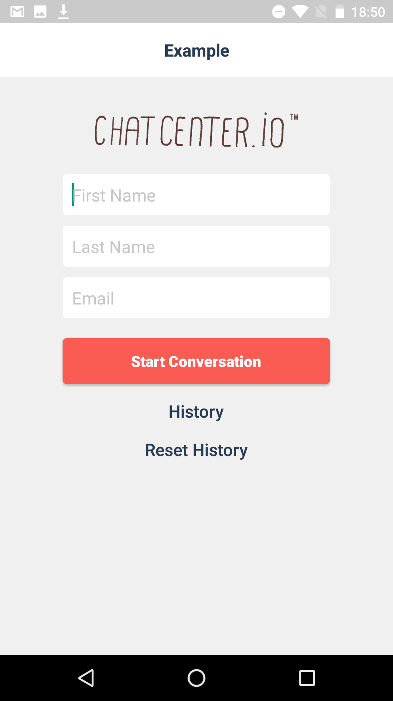
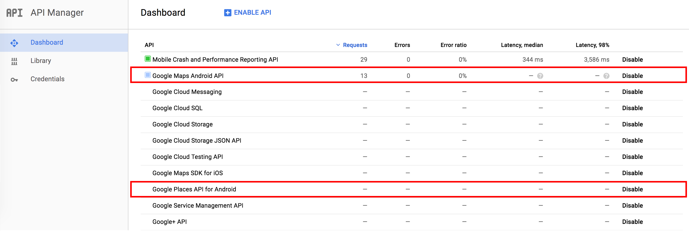

# ChatCenter iO Android SDKインストールガイド Ver. 1.1.1

## 目次
* [Getting Started](#GettingStarted)
	* [1. サンプルプロジェクトをダウンロード](#DLSample)
	* [2. アプリケーションを起動](#LaunchApp)
* [SDKをアプリに組み込む](#InstallYourApp)
	* [1. AndroidStudioでの設定](#SettingOfAndroidStudio)
	* [2. アプリトークンとチームIDのセット](#SetAppToken)
	* [3. チャットビューの呼び出し](#DispalyChatView)
	* [4. ヒストリービューの呼び出し](#DispalyHistoryView)
	* [5. ユーザーのログアウト](#LogoutUser)

<a id="GettingStarted"></a>
## Getting Started

<a id="DLSample"></a>
#### 1. サンプルプロジェクトをダウンロード
[こちら](https://github.com/chatcenter/android)よりChatCenterSDKをダウンロードします。
Sampleプロジェクトが含まれています。

<a id="LaunchApp"></a>
#### 2. アプリケーションを起動
<p align="center"></p>

<a id="InstallYourApp"></a>
## SDKをアプリに組み込む

<a id="SettingOfAndroidStudio"></a>
### 1. AndroidStudioでの設定

<a id="1InstallSDK"></a>
#### 1-1. SDKのインストール
アプリのbuild.gradleに以下を追加してください(tokboxはChatCenterSDK内で使用しているボイス/ビデオチャットのライブラリです)。

	repositories {   
		・・・   
		↓ 追加   
		maven { url  "http://tokbox.bintray.com/maven" }   
	}   
   
	dependencies {   
		・・・   
		↓ 追加   
		compile 'ly.appsocial:chatcenter-android-sdk:1.0.+';   
	}   

***

<a id="2CopyService"></a>
#### 1-2. SampleGcmListenerServiceのコピー
Sampleの中にあるSampleGcmListenerService.javaを自分のプロジェクトの中にコピーしてください。こちらはプッシュ通知を受け取るためのServiceになります。

***

<a id="3EditManifest"></a>
#### 1-2. AndroidManifestの編集
ChatCenter SDKでは各ウィジェットの送信時に、ユーザーの情報を使用する場合があります。そのためAndroidManifestに許諾の設定をお願いします。
許諾の必要があるものは以下です。

    <uses-permission android:name="android.permission.INTERNET" />
    <uses-permission android:name="android.permission.WAKE_LOCK" />
    <uses-permission android:name="android.permission.ACCESS_NETWORK_STATE" />


続いて、Sampleの時と同じようにAppTokenを`<application></application>`内に記述します。


    <meta-data
            android:name="ly.appsocial.chatcenter.AppToken"
            android:value="[YOUR_APP_TOKEN_HERE]"/>

Next, We are using Google Maps SDK in the Location Widget.  Please create Google API Key in dashboard of Google API and set it in `<application> </ application>` as done in Sample.

    <meta-data
           android:name="com.google.android.geo.API_KEY"
           android:value="[YOUR_GOOGLE_API_KEY]"/>
           
Please confirm both Google Maps and Google Places API for Android are enable in dashboard of Google API. 
<p align="center"></p>

#### 1-3. AndroidManifestの編集
ChatCenter SDKでは各ウィジェットの送信時に、ユーザーの情報を使用する場合があります。そのためAndroidManifestに許諾の設定をお願いします。
許諾の必要があるものは以下です。

	<uses-permission android:name="android.permission.INTERNET" />
	<uses-permission android:name="android.permission.WAKE_LOCK" />
	<uses-permission android:name="android.permission.ACCESS_NETWORK_STATE" />
	<uses-permission android:name="com.google.android.c2dm.permission.RECEIVE" />
	<uses-permission android:name="ly.appsocial.chatcenter.sdksample.permission.C2D_MESSAGE" />

	<permission
		android:name="ly.appsocial.chatcenter.sdksample.permission.C2D_MESSAGE"
		android:protectionLevel="signature" />


続いて、Sampleの時と同じようにAppTokenを`<application></application>`内に記述します。

	<meta-data
			android:name="ly.appsocial.chatcenter.AppToken"
			android:value="[YOUR_APP_TOKEN_HERE]"/>


ChatCenter SDKではロケーションウィジェットでGoogle Maps SDKを使用しています。
そのためGoogle APIのダッシュボードでGoogle API Keyを取得して、Samoleのように`<application></application>`内にセットしてください。

    <meta-data
           android:name="com.google.android.geo.API_KEY"
           android:value="[YOUR_GOOGLE_API_KEY]"/>

Please confirm both Google Maps and Google Places API for Android are enable in dashboard of Google API. 
またGoogle APIのダッシュボードにて、Google Maps Android APIおよびGoogle Places API for Androidが有効になっていることをご確認ください。
<p align="center"></p>

***

<a id="DispalyChatView"></a>
## 2. チャットビューの呼び出し
チャットを表示するチャットビューを呼び出します。
<p align="center"></p>

以下のコードをActivityの任意の場所に挿入してください。

```
ChatCenter.showChat(final Context context,
						final String orgUid,
						final String firstName,
						final String familyName,
						final String email,	
						final String provider,
						final String providerToken,
						final String providerTokenSecret,
						final String providerRefreshToken,
						final Long providerCreatedAt,
						final Long providerExpiresAt,
						final String deviceToken,
						final Map<String, String> channelInformations)
```

以下がパラメータです。太字が必須です。他のパラメータで不要な場合はnilをご指定ください。
以下がパラメータです。太字が必須です。他のパラメータで不要な場合はnilをご指定ください。<br>
**注意: 認証なしの場合は、ログインから30日後に自動ログアウトされます。また、後から認証処理を紐付けることは現在対応しておりません**  
<table>
	<tr>
		<th>Parameter name</th>
		<th>Facebook</th>
		<th>Twitter</th>
		<th>Anonymous</th>
	</tr>
	<tr>
        <td> context(Activity)</td>
        <td colspan="3"><b>遷移元のActivityを指定してください。</b></td>
    </tr>
	<tr>
		<td>orgUid(String)</td>
		<td colspan="3"><b>Chatに紐づく、チームIDを指定してください</b></td>
	</tr>
	<tr>
		<td>firstName(String)</td>
		<td colspan="2">生成するユーザーのファミリーネームを指定してください。nilを指定した場合はFacebook/Twitterに登録されているユーザーのファーストネームが使用されます。</td>
		<td>生成するユーザーのファーストネームを指定してください。</td>
	</tr>
	<tr>
		<td>familyName(String)</td>
		<td colspan="2">生成するユーザーのファミリーネームを指定してください。nilを指定した場合はFacebook/Twitterに登録されているユーザーのファミリーネームが使用されます。</td>
		<td>生成するユーザーのファミリーネームを指定してください。</td>
	</tr>
	<tr>
		<td>email(String)</td>
		<td colspan="2">生成するユーザーのEmailアドレスを指定してください。nilを指定した場合はFacebook/Twitterに登録されているEmailアドレスが使用されます(Facebook認証時にパーミッションを要求している必要があります)。</td>
		<td>生成するユーザーのEmailアドレスを指定してください。</td>
	</tr>
	<tr>
		<td>provider(String)</td>
		<td><b>@"facebook"を指定してください</b></td>
		<td><b>@"twitter"を指定してください</b></td>
		<td>nilを指定してください</td>
	</tr>
	<tr>
		<td>providerToken(String)</td>
		<td colspan="2"><b>認証結果のtokenを指定してください</b></td>
		<td>nilを指定してください</td>
	</tr>
	<tr>
		<td>providerTokenSecret(String)</td>
		<td>nilを指定してください</td>
		<td><b>Access token secretを指定してください</b></td>
		<td>nilを指定してください</td>
	</tr>
    <tr>
       <td>providerRefreshToken(String)</td>
       <td colspan="3">nilを指定してください</td>
    </tr>
	<tr>
		<td>providerCreatedAt(long)</td>
		<td colspan="3">nilを指定してください</td>
	</tr>
	<tr>
		<td>providerExpiresAt(long)</td>
		<td><b>認証結果のtokenの失効日(expirationDate)を指定してください</b></td>
		<td colspan="2">nilを指定してください</td>
	</tr>
	<tr>
		<td>deviceToken(String)</td>
		<td colspan="3">プッシュ通知で使用するdeviceTokenを指定してください</td>
	</tr>
	<tr>
		<td>channelInformations(JSONObject)</td>
		<td colspan="3">生成するchannelに紐づくurlを以下のように指定してください``例) @{@"url":@"https://app.asana.com"}``</td>
	</tr>
</table>

***

<a id="DispalyHistoryView"></a>
## 3. ヒストリービューの呼び出し
チャットの履歴一覧を表示するヒストリービューを呼び出します。  
<p align="center"></p>

以下のコードを任意の場所に挿入してください。

```
ChatCenter.showMessages(final Context context, 
						final String provider, 
						final String providerToken, 
						final String providerTokenSecret,
						final String providerRefreshToken,
						final int providerCreatedAt,
						final Date providerExpiresAt);
```

以下のコードを任意の場所に挿入してください。<br>
**注意: 認証なしの場合は、ログインから30日後に自動ログアウトされます。また、後から認証処理を紐付けることは現在対応しておりません**  

以下がパラメータです。太字が必須です。他のパラメータで不要な場合はnullをご指定ください。
<table>
	<tr>
		<th>パラメータ名</th>
		<th>Facebook</th>
		<th>Twitter</th>
		<th>Anonymous</th>
	</tr>
	<tr>
		<td>provider(String)</td>
		<td><b>@"facebook"を指定してください</b></td>
		<td><b>@"twitter"を指定してください</b></td>
		<td>nilを指定してください</td>
	</tr>
	<tr>
		<td>providerToken(String)</td>
		<td colspan="2"><b>認証結果のtokenを指定してください</b></td>
		<td>nilを指定してください</td>
	</tr>
	<tr>
		<td>providerTokenSecret(String)</td>
		<td>nilを指定してください</td>
		<td><b>Access token secretを指定してください</b></td>
		<td>nilを指定してください</td>
	</tr>
    <tr>
        <td>providerRefreshToken(String)</td>
        <td colspan="3">nilを指定してください</td>
    </tr>
	<tr>
		<td>providerCreatedAt(int)</td>
		<td colspan="3">nilを指定してください</td>
	</tr>
	<tr>
		<td>providerExpiresAt(Date)</td>
		<td><b>認証結果のtokenの失効日(expirationDate)を指定してください</b></td>
		<td>nilを指定してください</td>
		<td>nilを指定してください</td>
	</tr>
</table>

***

<a id="LogoutUser"></a>
## 4. ユーザーのログアウト
端末に保存されているデータを削除し、ログアウトするときは以下を呼んでください。  
``ChatCenter.signOut(context, SignOutCallback)``
***

<a id="Option"></a>
## 5. オプション

<a id="51CustomDesign"></a>
### 5.1 デザインのカスタマイズ

ChatViewのインターフェースを編集するには、Sampleの<b>/res/values</b>から<b>colors.xml</b>ファイルをコピーして値を上書きしてください。

#### Base color

```
<color tools:override="true" name="color_chatcenter_base">YOUR_BASE_COLOR</color>
```

ベースカラーを設定できます。主に以下に反映されます：

* (Chat View) 自分が送信したチャットバブルの背景色
* (Chat View) ウィジェットメニューのアイコン色
* (Chat View) ウィジェットメニューの色

#### Activity background

全てのアクティビティの背景色を変更します：

```
<color tools:override="true" name="color_chatcenter_background">YOUR_BACKGROUND_COLOR</color>
```

#### Custom ActionBar

ActionBarの背景色を設定します：

```
<color tools:override="true" name="color_chatcenter_title_background">YOUR_ACTIONBAR_BACKGROUND</color>
```

ActionBarのテキストカラーを設定します：

```
<color tools:override="true" name="color_chatcenter_title_text">YOUR_TITLE_TEXT_COLOR</color>
```

ActionBar上のボタンの背景色を設定します（voice / video chat icon, back / close button）：

```
<color tools:override="true" name="color_chatcenter_title_button_image">YOUR_BUTTON_COLOR</color>
```

ActionBar上のボタンのテキストカラーを設定します (Next/Done/Send Button)：

```
<color tools:override="true" name="color_chatcenter_title_button_text">YOUR_BUTTON_TEXT_COLOR</color>
```

### 5.2 プッシュ通知
#### 5.2.1. Server API Keyファイルをweb dashboard上で登録する
Google DashboardでプロジェクトのServer API Keyをコピーしてください。
次に、以下のようにChatCenterのweb dashboard（設定＞プッシュ通知）上で登録してください。
<p align="center"></p>

#### 5.2.2 プッシュ通知のオン
#### SharePreferencesにdevice tokenを保存する
Googleから取得したdevice tokenを以下のように保存すると、チャット/ヒストリービューを表示したタイミングでChatCenterのサーバーへ送信されて登録されます。

```
// SET UP YOUR TOKEN TO CHAT-CENTER SDK FOR PUSHING NOTIFICATION
CCAuthUtil.saveDeviceToken(Context context,String token);
```
###### パラメーター
<table>
	<tr>
		<th>パラメータ</th>
		<th>値</th>
	</tr>
	<tr>
		<td>context (Context)</td>
		<td>Application Context</td>
	</tr>
	<tr>
		<td>token (String)</td>
		<td>device token</td>
	</tr>
</table>

#### チャットビュー呼び出し時にdevice tokenを設定する

チャットビューを呼び出す際に、パラメーターにdevice tokenを設定するとChatCenterのサーバーへ送信されて登録されます。

#### 5.2.3. プッシュ通知のオフ：
サインアウトのタイミングで以下を呼び出して、プッシュ通知をオフにしてください。

```
public void signOutDeviceToken(String deviceToken);
```

**パラメーター**
<table>
<tr>
<th>パラメーター</th>
<th>値</th>
</tr>
<tr>
<td>deviceToken(String)</td>
<td><b>Googleから取得したdevice token</b></td>
</tr>
</table>

#### 5.2.4. プッシュ通知の受信
受信時のペイロードからorg_uidを取り出し、チャットビューの呼び出しを行ってください。
以下のようなペイロードが送信されます。

```
{
    data: {
      alert: "app_name You have a message from ChatCenter",
      badge: unread_count,
      app_name: "ChatCenter App name",
      app_token: "ChatCenter App token",
      org_uid: "Team ID(Company/Store ID)",
      channel_uid: "Channel UID",
      message: message_content,
      category: 'chat message'
    },
    notification: {
      body: body,
      title: 'ChatCenter iO'
    }
}
```

**変数**

* app_name -> App name
* app_token -> ChatCenter App token
* unread_count -> Number of unread channel
* org_uid -> Team ID(Company/Store ID)
* channel_uid -> Channel UID

***

