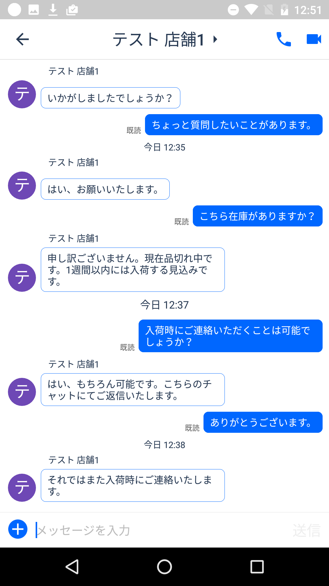
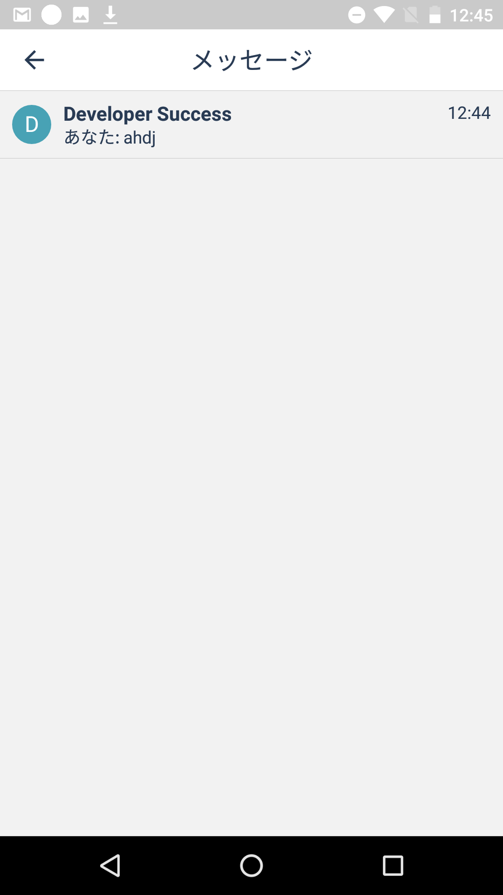

# ChatCenter iO Android SDK Installation guide Ver. 1.0.1

## Table of contents
* [Getting Started](#GettingStarted)
    * [1. Download sample project](#DLSample)
    * [2. Launch app](#LaunchApp)
* [Installing SDK on app](#InstallYourApp)
    * [1. Setting of Android Studio](#SettingOfAndroidStudio)
    * [2. Set AppToken](#SetAppToken)
    * [3. Display ChatView](#DispalyChatView)
    * [4. Display HistoryView](#DispalyHistoryView)
    * [5. Log out user](#LogoutUser)

<a id="GettingStarted"></a>
## Getting Started

<a id="DLSample"></a>
#### 1. Download sample project
You can download ChatCenter SDK from [here](https://github.com/chatcenter/android)
Example project is included.

<a id="LaunchApp"></a>
#### 2. Launch app
<p align="center"></p>

<a id="InstallYourApp"></a>
## Installing SDK on app

<a id="SettingOfAndroidStudio"></a>
### 1. Setting of Android Studio

<a id="1InstallSDK"></a>
#### 1-1. Installing SDK
Please add the following to build.gradle of the application (tokbox is a library of voice / video chat used in ChatCenterSDK).

    repositories {   
        ・・・   
        ↓ add   
        maven { url  "http://tokbox.bintray.com/maven" }   
    }   
   
    dependencies {   
        ・・・   
        ↓ add   
        compile 'ly.appsocial:chatcenter-android-sdk:1.0.+';   
    }   

***

<a id="2CopyService"></a>
#### 1-2. Copy SampleGcmListenerService
Please copy SampleGcmListenerService.java inside Sample into your project. This will be Service for receiving push notifications.

***

<a id="3EditManifest"></a>
#### 1-3. Edit AndroidManifest
ChatCenter SDK sometimes uses the user's information when sending each widget. Therefore, please set up permission on AndroidManifest.
Permission necessary are mentioned below.

    <uses-permission android:name="android.permission.INTERNET" />
    <uses-permission android:name="android.permission.WAKE_LOCK" />
    <uses-permission android:name="android.permission.ACCESS_NETWORK_STATE" />
    <uses-permission android:name="com.google.android.c2dm.permission.RECEIVE" />
    <uses-permission android:name="ly.appsocial.chatcenter.sdksample.permission.C2D_MESSAGE" />

    <permission
        android:name="ly.appsocial.chatcenter.sdksample.permission.C2D_MESSAGE"
        android:protectionLevel="signature" />


Next, describe AppToken in `<application> </ application>` as done in Sample.


    <meta-data
            android:name="ly.appsocial.chatcenter.AppToken"
            android:value="[YOUR_APP_TOKEN_HERE]"/>


Next, add necessary items including the Service you just copied into `<application> </ application>`.

        <receiver
            android:name="com.google.android.gms.gcm.GcmReceiver"
            android:exported="true"
            android:permission="com.google.android.c2dm.permission.SEND" >
            <intent-filter>
                <action android:name="com.google.android.c2dm.intent.RECEIVE" />
                <category android:name="com.codepath.gcmquickstart" />
            </intent-filter>
        </receiver>

        <service
            android:name=".SampleGcmListenerService"
            android:exported="false" >
            <intent-filter>
                <action android:name="com.google.android.c2dm.intent.RECEIVE" />
            </intent-filter>
        </service>

        <meta-data
            android:name="com.google.android.gms.version"
            android:value="@integer/google_play_services_version" />


***

<a id="DispalyChatView"></a>
## 2. Display ChatView
Call ChatView to display chat.
<p align="center"><br>*Image is iOS version</p>

### 2-1. When requiring authentication
Please insert the following code anywhere in Activity.

```
ChatCenter.showChat(this, orgUid, provider, providerToken, providerTokenCreatedAt, providerTokenExpiresDate, info);
```
The following are the parameters. Bold is mandatory. If other parameters are not required, please specify nil.
<table>
    <tr>
        <th>Name of parameter</th>
        <th>Facebook</th>
        <th>Twitter</th>
    </tr>
    <tr>
        <td>context(Activity)</td>
        <td colspan="2"><b>Please specify the original Activity</b></td>
    </tr>
    <tr>
        <td>orgUid(String)</td>
        <td colspan="2"><b>Please specify team ID based on Chat</b></td>
    </tr>
    <tr>
        <td>provider(String)</td>
        <td><b>Please specify "facebook"</b></td>
        <td><b>Please specify "twitter"</b></td>
    </tr>
    <tr>
        <td>providerToken(String)</td>
        <td colspan="2"><b>Please specify token of authentication result</b></td>
    </tr>
    <tr>
        <td>providerCreatedAt(Date)</td>
        <td colspan="2">Please specify null</td>
    </tr>
    <tr>
        <td>providerExpiresAt(Date)</td>
        <td><b>Please specify the expiration date (expirationDate) of the token of the authentication result</b></td>
        <td> Please specify null</td>
    </tr>
    <tr>
        <td>channelInformations(`Map<String, String>`)</td>
        <td colspan="2">Please specify url related to creating channel as below        ``
        Ex) 
        Map<String, String> info = new HashMap<>();   
        info.put("url", "https://app.asana.com");   
        ``</td>
    </tr>
</table>


### 2-2. When authentication is not required (Anonymous login)
**Note: In case of no authentication, user will be logged out automatically 30 days after login. Also, we do not currently support to link authentication processing afterwards**  
Please insert the following code in a convenient place.  

```
ChatCenter.showChat(this, orgUid, firstName, familyName, email, info);
```

#### Parameter
The following are the parameters. Bold is mandatory. If other parameters are not required, please specify nil.
<table>
    <tr>
        <th>Name of parameter</th>
        <th>Value</th>
    </tr>
    <tr>
        <td>context(Activity)</td>
        <td><b>Please specify the original Activity</b></td>
    </tr>
    <tr>
        <td>orgUid(String)</td>
        <td><b>Please specify team ID based on Chat * About Organization Uid(Company/Store ID)</b></td>
    </tr>
    <tr>
        <td>firstName(String)</td>
        <td>Please specify the first name of the user to be generated</td>
    </tr>
    <tr>
        <td>familyName(String)</td>
        <td>Please specify the family name of the user to be generated</td>
    </tr>
    <tr>
        <td>email(String)</td>
        <td>Please specify the Email address of the user to be generated</td>
    </tr>
    <tr>
        <td>channelInformations(`Map<String, String>`)</td>
        <td>Please specify url related to creating channel as below  
        ``
        Ex) 
        Map<String, String> info = new HashMap<>();
        info.put("url", "https://app.asana.com");
        ``</td>
    </tr>
</table>

***

<a id="DispalyHistoryView"></a>
## 3. Display HistoryView
Call history view to display chat history list.  
<p align="center">
<br>* Image is iOS version</p>

### 3-1. When requiring authentication
Please insert the following code in a convenient place.

```
    ChatCenter.showMessages(context, provider, providerToken, providerTokenTimestamp);
```

The following are the parameters. Bold is mandatory. If other parameters are not required, please specify nil.
<table>
    <tr>
        <th>Name of parameter</th>
        <th>Facebook</th>
        <th>Twitter</th>
    </tr>
    <tr>
        <td> context(Activity)</td>
        <td colspan="2"><b>Please specify the original Activity</b></td>
    </tr>
    <tr>
        <td>provider(String)</td>
        <td><b>@Please specify "facebook"</b></td>
        <td><b>@Please specify "twitter"</b></td>
    </tr>
    <tr>
        <td>providerToken(String)</td>
        <td colspan="2"><b>Please specify token of authentication result</b></td>
    </tr>
    <tr>
        <td> providerTokenTimestamp(Date)</td>
        <td><b>Please specify timestamp token of authentication result
</b></td>
        <td>Please specify null</td>
    </tr>
</table>


### 3-2. When authentication is not required (Anonymous login)
**Note: In case of no authentication, user will be logged out automatically 30 days after login. Also, we do not currently support to link authentication processing afterwards**  
Please insert the following code in a convenient place.  

```
ChatCenter.showMessages(context);
```

#### Parameter
The following are the parameters. Bold is mandatory. If other parameters are not required, please specify nil.
<table>
    <tr>
        <th>Name of parameter</th>
        <th>Value</th>
    </tr>
    <tr>
        <td>context(Activity)</td>
        <td><b>Please specify the original Activity</b></td>
    </tr>
</table>

***

<a id="LogoutUser"></a>
## 4. Log out user
Delete the data stored in the terminal and call the following when logging out.  
``ChatCenter.signOut(context, SignOutCallback)``
***


