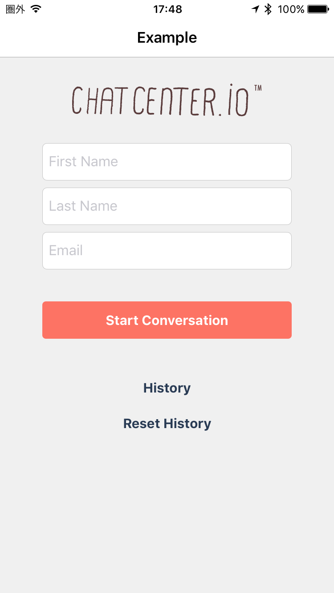
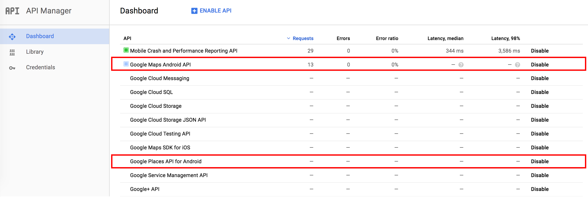
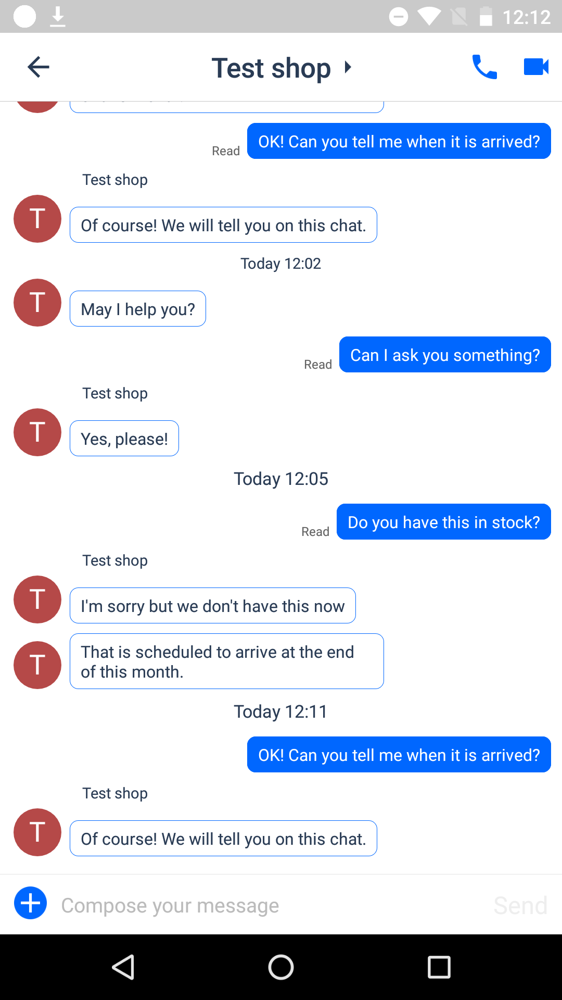
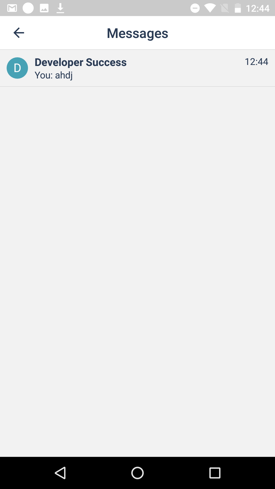
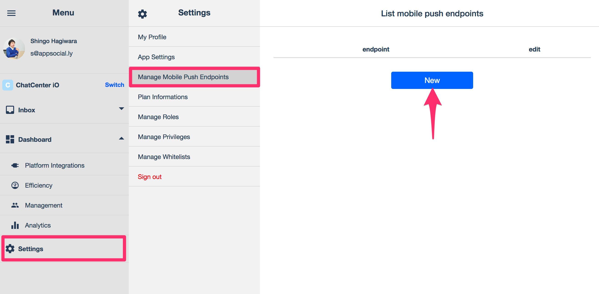
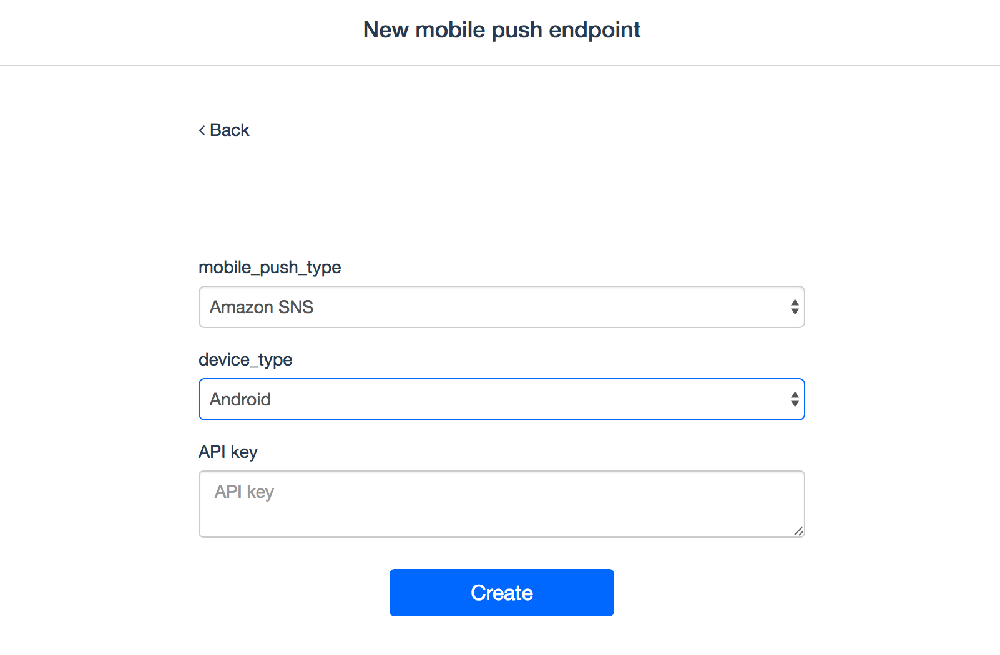

# ChatCenter iO Android SDK Installation guide Ver. 1.0.9

## Table of contents
* [Getting Started](#GettingStarted)
    * [1. Download sample project](#DLSample)
    * [2. Launch app](#LaunchApp)
* [Installing SDK on app](#InstallYourApp)
    * [1. Setting of Android Studio](#SettingOfAndroidStudio)
    * [2. Display ChatView](#DispalyChatView)
    * [3. Display HistoryView](#DispalyHistoryView)
    * [4. Log out user](#LogoutUser)
    * [5. Option](#Option)

<a id="GettingStarted"></a>
## Getting Started

<a id="DLSample"></a>
#### 1. Download sample project
You can download ChatCenter SDK from [here](https://github.com/chatcenter/android)
Example project is included.

<a id="LaunchApp"></a>
#### 2. Launch app
<p align="center"></p>

<a id="InstallYourApp"></a>
## Installing SDK on app

<a id="SettingOfAndroidStudio"></a>
### 1. Setting of Android Studio

<a id="1InstallSDK"></a>
#### 1-1. Installing SDK
Please add the following to build.gradle of the application.

    repositories {   
        ・・・   
        ↓ add   
        maven { url  "http://tokbox.bintray.com/maven" }   
    }   
   
    dependencies {   
        ・・・   
        ↓ add   
        compile 'ly.appsocial:chatcenter-android-sdk:1.0.+';   
    }   

***

<a id="2EditManifest"></a>
#### 1-2. Edit AndroidManifest
ChatCenter SDK sometimes uses the user's information when sending each widget. Therefore, please set up permission on AndroidManifest.
Permission necessary are mentioned below.

    <uses-permission android:name="android.permission.INTERNET" />
    <uses-permission android:name="android.permission.WAKE_LOCK" />
    <uses-permission android:name="android.permission.ACCESS_NETWORK_STATE" />


Next, describe AppToken in `<application> </ application>` as done in Sample.


    <meta-data
            android:name="ly.appsocial.chatcenter.AppToken"
            android:value="[YOUR_APP_TOKEN_HERE]"/>

Next, We are using Google Maps SDK in the Location Widget.  Please create Google API Key in dashboard of Google API and set it in `<application> </ application>` as done in Sample.

    <meta-data
           android:name="com.google.android.geo.API_KEY"
           android:value="[YOUR_GOOGLE_API_KEY]"/>
           
Please confirm both Google Maps and Google Places API for Android are enable in dashboard of Google API. 
<p align="center"></p>
           
***

<a id="DispalyChatView"></a>
## 2. Display ChatView
Call ChatView to display chat.
<p align="center"></p>

Please insert the following code in a convenient place.

```
ChatCenter.showChat(final Context context,
						final String orgUid,
						final String firstName,
						final String familyName,
						final String email,	
						final String provider,
						final String providerToken,
						final String providerTokenSecret,
						final String providerRefreshToken,
						final Long providerCreatedAt,
						final Long providerExpiresAt,
						final String deviceToken,
						final Map<String, String> channelInformations)
```

The following are the parameters. Bold is mandatory. If other parameters are not required, please specify null.<br>
**Note: In case of no authentication, user will be logged out automatically 30 days after login. Also, we do not currently support to link authentication processing afterwards**  
<table>
	<tr>
		<th>Parameter name</th>
		<th>Facebook</th>
		<th>Twitter</th>
		<th>Anonymous</th>
	</tr>
	<tr>
        <td> context(Activity)</td>
        <td colspan="3"><b>Please specify the original Activity</b></td>
    </tr>
	<tr>
		<td>orgUid(String)</td>
		<td colspan="3"><b>Please specify team ID based on Chat</b></td>
	</tr>
	<tr>
		<td>firstName(String)</td>
		<td colspan="2">Please specify the family name of the user to be generated. If null is specified, the family name of the user registered on Facebook / Twitter will be used.</td>
		<td>Please specify the first name of the user to be generated</td>
	</tr>
	<tr>
		<td>familyName(String)</td>
		<td colspan="2">Please specify the last name of the user to be generated. If null is specified, the family name of the user registered on Facebook / Twitter will be used.</td>
		<td>Please specify the last name of the user to be generated</td>
	</tr>
	<tr>
		<td>email(String)</td>
		<td colspan="2">Please specify the Email address of the user to be generated. If null is specified, the Email address of the user registered on Facebook / Twitter will be used. (Need to request permission at Facebook authentication)。</td>
		<td>Please specify the Email address of the user to be generated</td>
	</tr>
	<tr>
		<td>provider(String)</td>
		<td><b>@Please specify "facebook"</b></td>
		<td><b>@Please specify "twitter"</b></td>
		<td>Please specify null</td>
	</tr>
	<tr>
		<td>providerToken(String)</td>
		<td colspan="2"><b>Please specify token of authentication result</b></td>
		<td>Please specify null</td>
	</tr>
	<tr>
		<td>providerTokenSecret(String)</td>
		<td>Please specify <b>null</b></td>
		<td><b>Please specify Access token secret</b></td>
		<td>Please specify <b>null</b></td>
	</tr>
    <tr>
       <td>providerRefreshToken(String)</td>
       <td colspan="3">Please specify <b>null</b></td>
    </tr>
	<tr>
		<td>providerCreatedAt(long)</td>
		<td colspan="3">Please specify <b>null</b></td>
	</tr>
	<tr>
		<td>providerExpiresAt(long)</td>
		<td><b>Please specify the expiration date(expirationDate) of authentication</b></td>
		<td colspan="2">Please specify NULL</td>
	</tr>
	<tr>
		<td>deviceToken(String)</td>
		<td colspan="3">Please specify the deviceToken obtained from Google Clould Service</td>
	</tr>
	<tr>
		<td>channelInformations(Map)</td>
		<td colspan="3">Please specify url related to creating channel as below
``Ex) {"url":"https://app.asana.com"}``</td>
	</tr>
</table>

***

<a id="DispalyHistoryView"></a>
## 3. Display HistoryView
Call history view to display chat history list.  
<p align="center"></p>

Please insert the following code in a convenient place.

```
ChatCenter.showMessages(final Context context, 
						final String provider, 
						final String providerToken, 
						final String providerTokenSecret,
						final String providerRefreshToken,
						final int providerCreatedAt,
						final Date providerExpiresAt);
```

**Note: In case of no authentication, user will be logged out automatically 30 days after login. Also, we do not currently support to link authentication processing afterwards**  
Please insert the following code in a convenient place.  


The following are the parameters. Bold is mandatory. If other parameters are not required, please specify nil.
<table>
	<tr>
		<th>Name of parameter</th>
		<th>Facebook</th>
		<th>Twitter</th>
		<th>Anonymous</th>
	</tr>
	<tr>
		<td>provider(String)</td>
		<td><b>Please specify @"facebook"</b></td>
		<td><b>Please specify @"twitter"</b></td>
		<td>Please specify <b>null</b></td>
	</tr>
	<tr>
		<td>providerToken(String)</td>
		<td colspan="2"><b>Please specify token of authentication result</b></td>
		<td>Please specify <b>null</b></td>
	</tr>
	<tr>
		<td>providerTokenSecret(String)</td>
		<td>Please specify <b>null</b></td>
		<td><b>Please specify Access token secret</b></td>
		<td>Please specify <b>null</b></td>
	</tr>
    <tr>
        <td>providerRefreshToken(String)</td>
        <td colspan="3">Please specify <b>null</b></td>
    </tr>
	<tr>
		<td>providerCreatedAt(int)</td>
		<td colspan="3">Time stamp (in seconds).</td>
	</tr>
	<tr>
		<td>providerExpiresAt(Date)</td>
		<td><b>Please specify the expiration date(expirationDate) of authentication</b></td>
		<td>Please specify <b>null</b></td>
		<td>Please specify <b>null</b></td>
	</tr>
</table>

***

<a id="LogoutUser"></a>
## 4. Log out user
Delete the data stored in the terminal and call the following when logging out.  

```
ChatCenter.signOut(context, SignOutCallback)
```
***

<a id="Option"></a>
## 5. Option

<a id="51CustomDesign"></a>
### 5.1 Custom Design

To change color of ChatCenter views, please copy file <b>colors.xml</b> in <b>/res/values</b> folder in Sample and override color value.

#### Base color

```
<color tools:override="true" name="color_chatcenter_base">YOUR_BASE_COLOR</color>
```

You can set the base color of the design. Mainly applied to:

* (Chat View) Background color of chat bubble sent by you
* (Chat View) Widget Menu Icon Colors
* (Chat View) Widget menu color

#### Activity background

Change background color of all activities:

```
<color tools:override="true" name="color_chatcenter_background">YOUR_BACKGROUND_COLOR</color>
```

#### Custom ActionBar

Setting background color of ActionBar:

```
<color tools:override="true" name="color_chatcenter_title_background">YOUR_ACTIONBAR_BACKGROUND</color>
```

Setting text color of title on ActionBar:

```
<color tools:override="true" name="color_chatcenter_title_text">YOUR_TITLE_TEXT_COLOR</color>
```

Setting color of ImageButton on ActionBar (voice / video chat icon, back / close button):

```
<color tools:override="true" name="color_chatcenter_title_button_image">YOUR_BUTTON_COLOR</color>
```

Setting text color of Button on ActionBar (Next/Done/Send Button):

```
<color tools:override="true" name="color_chatcenter_title_button_text">YOUR_BUTTON_TEXT_COLOR</color>
```

### 5.2 Remote notification.
#### 5.2-1. Set Server API Key file in web dashboard
Go to Google Dashboard copy Server API Key of your project and sets it to ChatCenter Server with following simple steps:

* Log into ChatCenter web dashboard, select <b>Settings</b> > <b>Manage Mobile Push Endpoints</b> and then click <b>New</b> button.
<p align="center"></p>

* On next Screen, please select <b>Android</b> for <b>device_type</b>, sets your <b>Server API key</b> and then click <b>Create</b> button to finish.
<p align="center"></p>

#### 5.2.2. Turning on Push notification
#### Store device token in SharePreferences
When device token is retrieved from Google please share your token with ChatCenter SDK with following simple line of code. The token will be sent to ChatCenter sever when opening Chat/History view.

```
// SET UP YOUR TOKEN TO CHAT-CENTER SDK FOR PUSHING NOTIFICATION
CCAuthUtil.saveDeviceToken(Context context,String token);
```
###### Parameters
<table>
	<tr>
		<th>Name of parameter</th>
		<th>Value</th>
	</tr>
	<tr>
		<td>context (Context)</td>
		<td>Application Context</td>
	</tr>
	<tr>
		<td>token (String)</td>
		<td>Your device token</td>
	</tr>
</table>

#### Set device token when displaying chat view

When calling chat view, set the device token acquired from Google to deviceToken param. Push notification is enabled at the time of registration.

#### 5.2.3. Turning off Push Notification:
Please call the following at the timing when you want to invalidate Push notification, such as sign-out.

```
public void signOutDeviceToken(String deviceToken);
```

**Parameter**
The following are the parameters. Bold is mandatory. If other parameters are not required, please specify nil.
<table>
<tr>
<th>Name of parameter</th>
<th>Value</th>
</tr>
<tr>
<td>deviceToken(String)</td>
<td><b>Please specify the deviceToken obtained from Google for using Push notification</b></td>
</tr>
</table>

#### 5.2.4. Receiving Push notification
Please retrieve org_uid from the payload at reception and perform Display chat view.
The following payload will be sent.

```
{
    data: {
      alert: "app_name You have a message from ChatCenter",
      badge: unread_count,
      app_name: "ChatCenter App name",
      app_token: "ChatCenter App token",
      org_uid: "Team ID(Company/Store ID)",
      channel_uid: "Channel UID",
      message: message_content,
      category: 'chat message'
    },
    notification: {
      body: body,
      title: 'ChatCenter iO'
    }
}
```

**Variable**

* app_name -> App name
* app_token -> ChatCenter App token
* unread_count -> Number of unread channel
* org_uid -> Team ID(Company/Store ID)
* channel_uid -> Channel UID

***

